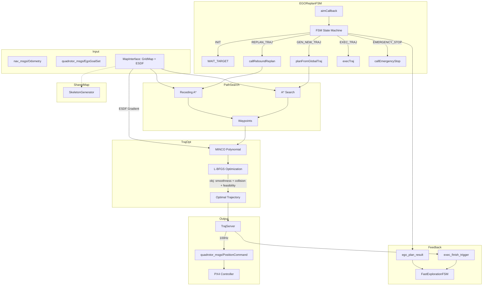

# EGO-Planner — 实时轨迹优化

> EGO-Planner（Edge-based Gradient Optimization Planner）是 USS-NAV 的**底层轨迹规划器**，负责将 FastExplorationFSM 下发的导航目标转换为可执行的平滑轨迹。

---

## 概述

EGO-Planner 位于规划栈的最底层，接收来自 `FastExplorationFSM` 的 `EgoGoalSet` 目标消息，通过 A\* 路径搜索 + MINCO 轨迹优化，生成满足动力学约束的无碰撞轨迹，最终以 `PositionCommand` 形式下发至 PX4 飞控。

系统位于 `planner/ego_plannerv3/plan_manage/` 目录，与 `map_interface/`（共享地图接口）、`plan_env/`（占用网格+ESDF）、`path_searching/`（A\*）、`traj_opt/`（MINCO+L-BFGS）协同工作。

### 在系统中的位置

```
FastExplorationFSM (UAV 任务调度)
       │
       │ EgoGoalSet (/local_goal)
       ▼
EGOReplanFSM (12 状态 FSM)
       │
       ├─ A* Path Searching
       ├─ MINCO Trajectory Optimization (L-BFGS)
       └─ TrajServer → PositionCommand
       │
       ▼
PX4 Controller
```

---

## 算法管道



### FSM 状态机

EGOReplanFSM 包含 12 个执行状态：

| 状态 | 说明 |
|------|------|
| `INIT` | 初始化，等待触发 |
| `WAIT_TARGET` | 等待 FastExplorationFSM 下发目标 |
| `HANDLE_YAW` | 偏航处理模式 |
| `GEN_NEW_TRAJ` | 生成全新轨迹（首次规划） |
| `REPLAN_TRAJ` | 重规划（障碍物避让） |
| `EXEC_TRAJ` | 执行轨迹 |
| `EMERGENCY_STOP` | 紧急停止 |
| `SEQUENTIAL_START` | 顺序启动 |
| `CRASH_RECOVER` | 碰撞恢复 |
| `WAIT_YAW` | 等待偏航到位 |

### 核心算法

| 组件 | 方法 | 输入 | 输出 |
|------|------|------|------|
| `dyn_a_star.cpp` | A\* 搜索 | 起点 + 终点 + GridMap | 路径点序列 |
| `poly_traj_optimizer.cpp` | MINCO 参数化 | 路径点 + 时间分配 | 分段多项式轨迹 |
| `poly_traj_optimizer.cpp` | L-BFGS 优化 | 初始轨迹 + ESDF | 最优轨迹 |
| `traj_server.cpp` | 轨迹插值 | 优化后轨迹 | PositionCommand @ 100Hz |

---

## 栅格地图架构

EGO-Planner 使用 `MapManager` 管理两层栅格地图，定义在 `plan_env/grid_map.h`。所有碰撞检查、ESDF 梯度、路径搜索都基于此地图系统。

### MapManager 双地图结构

```cpp
// grid_map.h:869-870
GridMap::Ptr sml_, big_;   // 两张地图实例
GridMap::Ptr cur_;          // 当前活跃地图指针
```

| 变量 | 含义 | 分辨率 | 范围 | ESDF | 膨胀层 | 用途 |
|------|------|--------|------|------|--------|------|
| `sml_` | 局部小地图（SML） | ROS 参数 `local_update_range_*` | 传感器范围 ~8m | 否 | 是 | FSM 碰撞检测、`MapInterface` 对外接口、`getInflateOccupancy()` |
| `big_` | 大地图（BIG） | 固定 0.25m | 20×20×5m | 是 | 否 | ESDF 梯度优化、悲观距离查询 `getDistancePessi()`、frontier 密度评估 |
| `cur_` | 当前活跃指针 | — | — | — | — | A\* 搜索、`getOcc()` 统一入口，始终指向 `sml_` 或 `big_` |

### 初始化

在 `grid_map.cpp:1915-1927` 的 `initMapManager()` 中：

- `sml_` 从 ROS 参数服务器读取 `grid_map/local_update_range_x/y/z`，构建传感器局部占据栅格地图
- `big_` 通过 `paramAdjust(0.25, 20.0, 20.0, 5.0, ...)` 覆写为固定参数，启用 ESDF 和多线程
- 默认 `cur_ = sml_`

### 切换逻辑

在 `planner_manager.cpp:701-711` 中根据规划地平线自动切换：

```cpp
if (planning_horizen * 2 / 3 < sml_->getLocalMapRange().maxCoeff())
  setMapUse(SMALL);   // cur_ = sml_, speed_mode = SLOW
else
  setMapUse(LARGE);   // cur_ = big_, speed_mode = FAST
```

- **SMALL 模式**：规划在局部地图范围内 → 使用高分辨率膨胀占用地图，低速安全飞行
- **LARGE 模式**：规划超出局部传感器范围 → 使用 ESDF 大地图，高速飞行，距离场提供更保守的碰撞代价

### 关键引用位置

| 文件 | 行号 | 内容 |
|------|------|------|
| `plan_env/include/plan_env/grid_map.h` | 869-898 | `MapManager` 定义（`sml_`/`big_`/`cur_`、`MAP_USE` 枚举、`getOcc()`） |
| `plan_env/src/grid_map.cpp` | 1915-1959 | `initMapManager()`、`setMapUse()` 实现 |
| `plan_manage/src/planner_manager.cpp` | 701-711 | 双地图切换决策 |
| `plan_manage/src/ego_replan_fsm.cpp` | 380, 1588, 1624 | FSM 中直接使用 `map_->sml_` 做碰撞恢复 |
| `traj_opt/src/poly_traj_optimizer.cpp` | 2768 | 使用 `map_->big_->evaluateESDFWithGrad()` 做梯度代价 |
| `path_searching/include/path_searching/dyn_a_star.h` | 78-79 | A\* 通过 `map_->cur_->getInflateOccupancy()` 检查占据 |
| `map_interface/include/map_interface/map_interface.hpp` | 90-98, 289-297 | `MapInterface` 委托 `sml_` 对外暴露 `isInLocalMap()` 等接口 |

## 输出接口

### ROS 话题

| 话题 | 类型 | 方向 | 频率 | 说明 |
|------|------|------|------|------|
| 订阅：`local_goal` | `quadrotor_msgs/EgoGoalSet` | 输入 | 按需 | FastExplorationFSM 下发的目标 |
| 订阅：`odom_world` | `nav_msgs/Odometry` | 输入 | 100Hz | 无人机里程计 |
| 订阅：`mandatory_stop` | `std_msgs/Empty` | 输入 | - | 紧急停止指令 |
| 订阅：`if_handle_yaw` | `std_msgs/Bool` | 输入 | 按需 | 偏航处理开关 |
| 发布：`/position_cmd` | `quadrotor_msgs/PositionCommand` | 输出 | 100Hz | 位置/速度/加速度/偏航指令 |
| 发布：`/planning/ego_plan_result` | `quadrotor_msgs/EgoPlannerResult` | 反馈 | 每周期 | 规划结果状态 |
| 发布：`exec_finish_trigger` | `std_msgs/Bool` | 反馈 | 到达时 | 轨迹执行完成通知 |
| 发布：`/planning/ego_state_trigger` | `quadrotor_msgs/EgoStateTrigger` | 反馈 | 稳定时 | 目标到达稳定触发 |
| 发布：`planning/data_display` | `traj_utils/DataDisp` | 调试 | ~1Hz | 规划数据可视化 |
| 发布：`/ground_height_measurement` | `std_msgs/Float64` | 调试 | ~1Hz | 地面高度估计 |

### PositionCommand（核心输出消息）

```yaml
Header header
float64 position[3]       # 目标位置 [m]
float64 velocity[3]       # 目标速度 [m/s]
float64 acceleration[3]   # 目标加速度 [m/s²]
float64 yaw               # 目标偏航 [rad]
float64 yaw_rate          # 目标偏航速率 [rad/s]
int8    trajectory_id     # 轨迹 ID
int8    command_id        # 命令 ID
```

---

## 与 SceneGraph 的集成

### 共享依赖关系

```
exploration_node (同一进程)
├── FastExplorationFSM
│   ├── SceneGraph
│   │   ├── SkeletonGenerator
│   │   └── ObjectFactory
│   └── MapInterface::Ptr  ←── 共享指针
│
├── EGOReplanFSM
│   ├── EGOPlannerManager
│   │   ├── MapManager ←── MapInterface::map_ (同一 GridMap)
│   │   ├── poly_traj_optimizer (MINCO + L-BFGS)
│   │   └── PlanningVisualization
│   └── TrajServer
```

### 接口分界

| SceneGraph 层 | Ego Planner 层 | 中介 |
|---------------|----------------|------|
| 拓扑骨架推理 | 不感知 | FastExplorationFSM 翻译为位置目标 |
| 语义区域决策 | 不感知 | LLM → 目标区域 → EgoGoalSet |
| 物体 ID 导航 | 仅消费 3D 位置 | getPathToObjectWithId → pubLocalGoal |
| 占用网格 + ESDF | 碰撞检查 + ESDF 梯度 | MapInterface 指针共享 |

### 消息契约

#### EgoGoalSet（上游 → EGO）

消息定义：`quadrotor_msgs/EgoGoalSet`，发布在 `/local_goal` topic。

```
FastExplorationFSM → EGOReplanFSM (local_goal):
  uint8      drone_id           # 目标无人机 ID（蜂群路由过滤）
  uint8      source_task_id     # 任务来源: EXPLORATION(2) / COUNTING(8) / VLA_SWARM(9)
  float32[3] goal               # 3D 目标世界坐标 [m]
  float32    yaw                # 目标偏航角 [rad]
  bool       look_forward       # true=沿飞行方向动态算 yaw; false=保持静态 yaw
  bool       goal_to_follower   # 标记是否为转发给 follower 的目标
  bool       yaw_low_speed      # (legacy) 低俗 yaw 回退标记
  uint8      yaw_mode           # 转速档位: NORMAL(0) / LOW_SPEED(1) / PANORAMA(2)
  uint8      yaw_path_mode      # 角误差计算: SHORTEST(0) / KEEP_DIRECTION(1)
```

每个字段的动机：

| 字段 | EGO Planner 中控制的行为 |
|------|-------------------------|
| `drone_id` | `aimCallback()` 中检查 `msg->drone_id != self` → 拒绝，防多机串号 |
| `source_task_id` | `yaw_mode=PANORAMA` 需要准入检查——仅 `EXPLORATION/COUNTING` 允许；`VLA_SWARM` 等任务触发兜底 `NORMAL+SHORTEST` |
| `goal[3]` | 核心输入——`target_pos_` → `planNextWaypoint()` → A\* → MINCO，无此字段无轨迹 |
| `yaw` | `target_yaw_` 归一化到 `[-pi, pi]` → `TrajServer::setYaw()`，控制到达时的朝向 |
| `look_forward` | `true` 时 `TrajServer::calculate_yaw()` 覆盖静态 yaw，从速度方向算朝向；`false` 时保持给定 yaw，用于物体跟踪 |
| `goal_to_follower` | EGO 端未使用（bridge 层路由标记），`aimCallback` 中无相关逻辑 |
| `yaw_low_speed` | 向下兼容：若 `yaw_mode=0` 且此标记 `true`，自动升级为 `LOW_SPEED` |
| `yaw_mode` | 选择 `TrajServer` 中 `YDM/YDDM` 的限值：`NORMAL`（正常快旋）/ `LOW_SPEED`（低速）/ `PANORAMA`（~0.3 rad/s 慢旋+制动减速逻辑） |
| `yaw_path_mode` | 角误差计：`SHORTEST` 取 `[-pi, pi]` 最短弧 / `KEEP_DIRECTION` 可累积多圈旋转（全景扫描用） |

#### EgoPlannerResult（EGO → 上游）

```
EGOReplanFSM → FastExplorationFSM (/planning/ego_plan_result):
  geometry_msgs/Vector3 planner_goal  # 实际规划的目标点
  int16                  plan_times   # 规划尝试次数
  bool                   plan_status  # 规划是否成功
  bool                   modify_status# 目标是否被修改

  std_msgs/Bool (exec_finish_trigger):
    true  → 轨迹执行完毕，可下发下一目标
```

---

## 配置

| 参数 | 默认值 | 说明 |
|------|--------|------|
| `no_replan_thresh_` | 0.5 m | 不触发重规划的容忍距离 |
| `emergency_time_` | 1.0 s | 紧急停止等待时间 |
| `enable_fail_safe_` | true | 启用故障安全模式 |
| `flag_realworld_experiment_` | false | 实机模式标志 |
| `ego_state_trigger_pos_thresh_` | 0.2 m | 目标到达位置阈值 |
| `ego_state_trigger_vel_thresh_` | 0.1 m/s | 目标到达速度阈值 |

---

## 代码组织

```
ws_main/src/planner/ego_plannerv3/
├── plan_manage/              # 主 FSM + 规划器管理器
│   ├── include/plan_manage/
│   │   ├── ego_replan_fsm.h        # 12 状态 FSM
│   │   ├── planner_manager.h       # EGOPlannerManager
│   │   └── traj_server.h           # 高频率轨迹插值发布
│   └── src/
│       ├── ego_replan_fsm.cpp
│       ├── planner_manager.cpp
│       └── traj_server.cpp
│
├── plan_env/                 # 环境地图
│   ├── include/plan_env/
│   │   └── grid_map.h              # GridMap + ESDF
│   └── src/
│       └── grid_map.cpp
│
├── traj_opt/                 # 轨迹优化
│   ├── include/optimizer/
│   │   └── poly_traj_optimizer.h   # MINCO + L-BFGS
│   └── src/
│       └── poly_traj_optimizer.cpp
│
├── path_searching/           # 路径搜索
│   ├── include/path_searching/
│   │   └── dyn_a_star.h            # 动态 A*
│   └── src/
│       └── dyn_a_star.cpp
│
└── map_interface/            # 共享地图接口
    └── include/map_interface/
        └── map_interface.hpp  # 隔离层，FastExplorationFSM + EGO 共用
```
