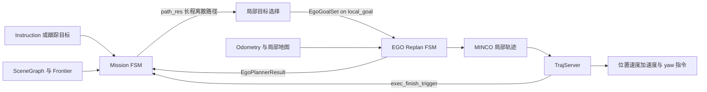
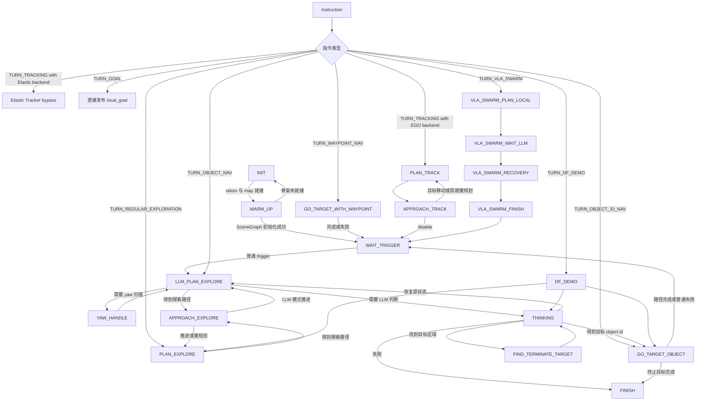
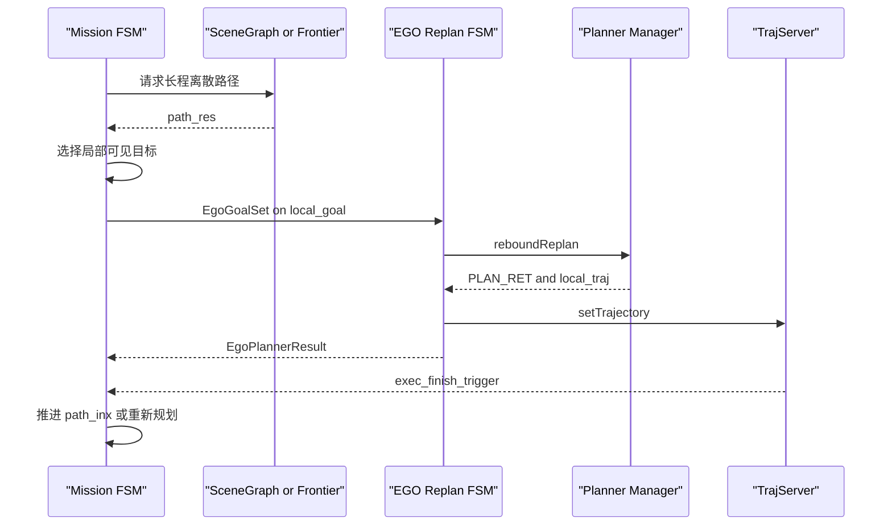
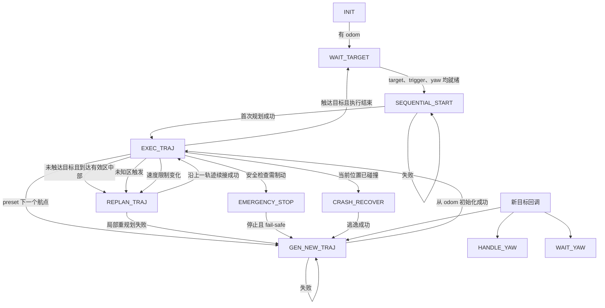
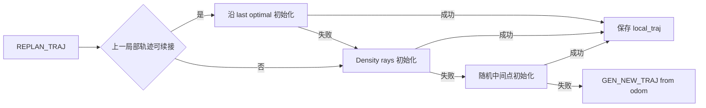

# Mission FSM 与 EGO-Planner v3 分支及轨迹边界审计

> 审计对象：当前工作区源码，而非上游论文或历史 EGO-Planner。生成日期：2026-07-03。

## 1. 结论先行

1. **Mission FSM 是长程任务/路径分解层，EGO Planner 是滚动局部轨迹层。** Mission FSM 或 SceneGraph 保存长程路径 `path_res_`，挑选当前局部可见点后，通过 ROS `local_goal` 下发给 EGO。
2. **当前 EGO v3 只实际维护和执行 `local_traj`。** `GlobalTrajData` 仅有类型定义，没有被 `TrajContainer` 持有，也没有当前 v3 调用点。`planFromGlobalTraj()` 这个名字容易误导：它从 odometry 和最终目标重新初始化局部轨迹，并不是跟踪一个已存储的全局多项式轨迹。
3. **短程轨迹长度由滚动规划窗限制：**

   $$H = \max(3v, 6\ \mathrm{m})$$

   其中 `v` 是本次规划速度。轨迹在到达最终目标前通常只覆盖不超过该 horizon 的局部段。
4. **短程轨迹末端是硬边界状态：**

   | 情况 | 末端位置 | 末端速度 | 末端加速度 |
   |---|---|---|---|
   | `touch_goal = true` | 最终目标或安全修正后的目标 | `0` | `0` |
   | `touch_goal = false` | horizon 截断点 | 指向最终目标，模长 `0.7 * max_vel` | `0` |

5. **两个实现不一致需要关注：** EGO 头文件注释声称 12-state，枚举实际只有 10 个；`WAIT_YAW` 可被回调设置，但 `execFSMCallback()` 没有对应 `case`。

## 2. 两层规划职责



### 2.1 Mission 层负责什么

- 根据 Instruction 类型选择探索、目标物、航点、跟踪或 VLA Swarm 分支。
- SceneGraph/Frontier 生成长程离散路径 `fd_->path_res_`。
- `getAndPublishNextAim()` 优先从路径尾部反向寻找“位于局部地图内且从当前位置可见”的最远点；找不到时按 `path_inx_` 顺序推进。
- 通过 `pubLocalGoal()` 发布 `quadrotor_msgs::EgoGoalSet`。
- 根据 EGO 的规划结果和执行完成反馈，继续下一个路径点、重新规划或结束任务。

### 2.2 EGO 层负责什么

- 接收一个位置目标、yaw 模式和 look-forward 设置。
- 根据 odometry 或当前轨迹预测状态建立连续的起点 PVAJ。
- 在动态 horizon 内生成 MINCO 初值，执行碰撞检查、拓扑分支和 L-BFGS 优化。
- 把成功结果保存为唯一实际执行的 `local_traj`，交给 `TrajServer`。
- 执行到优化有效区间中部、进入大量未知空间、速度限制明显变化或检测到碰撞时滚动重规划。

## 3. Mission FSM 主分支

当前 `MISSION_FSM_STATE` 枚举有 24 个值。`STOP` 和 `UNKONWN` 没有主 switch 行为；VLA 的若干后续状态仍是 placeholder。



### 3.1 Instruction 到分支的映射

| Instruction | Mission 分支 | 给 EGO 的行为 |
|---|---|---|
| `TURN_GOAL` | Mission 状态先回到 `WAIT_TRIGGER` | 第一个 goal 直接发 `local_goal` |
| `TURN_WAYPOINT_NAV` | `GO_TARGET_WITH_WAYPOINT` | SceneGraph 拓扑路径分段下发 |
| `TURN_OBJECT_ID_NAV` | `GO_TARGET_OBJECT` | 到对象的 SceneGraph 路径分段下发 |
| `TURN_OBJECT_NAV` | `LLM_PLAN_EXPLORE` | LLM/SceneGraph 路径分段下发 |
| `TURN_REGULAR_EXPLORATION` | `PLAN_EXPLORE` | Frontier 路径分段下发 |
| `TURN_DF_DEMO` | `DF_DEMO` | 在探索、思考、目标物导航之间切换 |
| `TURN_TRACKING` | `PLAN_TRACK` 或外部 Elastic Tracker | EGO 后端周期更新局部跟踪目标；Elastic 后端绕开 EGO 轨迹输出 |
| `TURN_VLA_SWARM` | VLA 子 FSM | 当前 PLACE 后续阶段仍进入 recovery placeholder，尚未形成完整 EGO 闭环 |

## 4. Mission FSM 如何耦合 EGO Planner



### 4.1 前向接口

Topic `local_goal` 的消息是 `quadrotor_msgs::EgoGoalSet`：

- `goal[3]`：局部目标位置。
- `look_forward`：沿轨迹方向控制 yaw，或使用显式目标 yaw。
- `yaw`、`yaw_mode`、`yaw_path_mode`：普通、低速、全景以及最短角/保持旋向。
- `source_task_id`：把上层任务来源带到下游。

Mission 并不把整条 `path_res_` 发送给 EGO；每次只发一个局部目标。因此两层耦合是**目标级弱耦合**，不是共享同一条轨迹对象。

### 4.2 反馈接口

| Topic | 方向 | Mission 使用字段/语义 |
|---|---|---|
| `/planning/ego_plan_result` | EGO → Mission | `planner_goal`、`plan_times`、`plan_status`、`modify_status` |
| `exec_finish_trigger` | EGO/TrajServer → Mission | 当前目标执行完成 |
| `/planning/ego_state_trigger` | EGO → 其他任务层 | 最终目标附近且 PVA/yaw-rate 稳定保持后触发 |

Mission 的 `APPROACH_*`、`GO_TARGET_*` 分支依据规划是否成功、目标是否被 EGO 修正、执行是否完成及当前位置距离，决定推进路径索引或回到 plan 状态。

## 5. EGO Replan FSM 内部分支

当前枚举实际为 10 个状态，不是头文件注释中的 12 个。



### 5.1 规划入口的分支策略

`planFromGlobalTraj()`：

1. 起点取当前 odometry，起始加速度和 jerk 清零。
2. 对“当前位置 → 最终目标”做 density ray 评估。
3. 使用 density path 初始化；失败后允许随机初始化。
4. 最多调用若干次 `reboundReplan()`。

`planFromLocalTraj()`：

1. 优先从当前已执行轨迹在“当前时刻 + 上次成功规划耗时”的 PVAJ 状态续接。
2. 失败后重新做 density path 初始化。
3. 再失败则使用随机中间点初始化。
4. 仍失败则退回 `GEN_NEW_TRAJ`，从 odometry 重建。



### 5.2 优化器内部分支

- 初值来源：上一最优轨迹、density ray 路径或随机中间点。
- `finelyCheckAndSetConstraintPoints()` 对初值做碰撞检查，并产生需要 A* 绕障的区段。
- `use_multitopology_trajs = true` 时生成多个拓扑约束候选，逐个优化并选择最低代价成功轨迹。
- 否则只优化一个候选。
- 优化结果始终落到 `TrajContainer::local_traj`。

## 6. 长程轨迹与短程轨迹的准确判断

### 6.1 当前是否存在长程轨迹

需要区分“长程路径”和“长程连续轨迹”：

| 对象 | 当前存在 | 所在层 | 说明 |
|---|---|---|---|
| 长程离散路径 | 是 | Mission/SceneGraph/Frontier | `path_res_`，由 Mission 分段消费 |
| EGO 最终目标 | 是 | EGO FSM | `final_goal_`，用于局部轨迹方向和是否触达目标判断 |
| EGO 长程连续多项式轨迹 | **否** | 类型残留但未接线 | `GlobalTrajData` 只有定义，无持有者和调用点 |
| EGO 短程连续轨迹 | 是 | EGO Planner | `TrajContainer::local_traj`，MINCO 多项式，实际下发执行 |

因此，架构应描述为“Mission 长程离散规划 + EGO receding-horizon 局部连续优化”，不能描述为 EGO 内部同时执行 global trajectory 和 local trajectory。

### 6.2 短程 horizon

`computePlanningParams()` 每次规划计算：

```text
planning_horizon = max(3.0 s × max_vel, 6.0 m)
piece_length     = planning_horizon / 6
```

约束点密度随 horizon 档位变化；并根据 `2/3 horizon` 与小地图范围的关系选择 SMALL/FAST 或 LARGE map 模式。

## 7. 短程轨迹末端约束

### 7.1 触达最终目标

当局部采样确实走到 `final_goal` 时，`touch_goal = true`：

```text
tail position     = final_goal 或占据检查后的 nearby safe point
tail velocity     = [0, 0, 0] m/s
tail acceleration = [0, 0, 0] m/s²
```

这些状态被写入 MINCO `tailState`，优化时作为固定边界传入。因此这不是软代价，而是轨迹边界条件。

### 7.2 未触达最终目标

当路径被 planning horizon 截断时，`touch_goal = false`：

```text
tail position     = trajPtVec.back 的局部截断点
tail velocity     = normalize(final_goal - tail_position) × 0.7 × max_vel
tail acceleration = [0, 0, 0] m/s²
```

非零末速度使滚动轨迹不会在每个局部 horizon 末端人为停车。EGO 在到达优化有效区中部后即触发下一轮 `REPLAN_TRAJ`，通常不会把未触达目标的局部轨迹完整执行到末端。

### 7.3 末端位置安全修正

若初值末端落在占据栅格内，`computeInitState()` 会在最多 4 voxel 邻域查找 `nearby safe point` 并替换末端位置。此时：

- “触达目标”的几何位置可能不再严格等于原始 `final_goal`；
- 但 `touch_goal` 标志在修正前已经决定，末速度仍可能采用零速度；
- 上层可通过 `EgoPlannerResult.modify_status` 感知目标修正状态。

## 8. 当前实现风险与建议

### 8.1 `WAIT_YAW` 无执行分支

`aimCallback*()` 在 panorama yaw 情况可切换到 `WAIT_YAW`，但 `execFSMCallback()` 的 switch 没有 `case WAIT_YAW`。默认分支只退出本轮 callback，状态不会自行推进。这是实际控制流缺口，应补充明确的 yaw 完成条件和后继状态。

### 8.2 状态数量注释不一致

`ego_replan_fsm.h` 写着 “12-state”，但枚举和日志字符串都只有 10 个。文档和 Doxygen 应改成 10-state，除非还有两个计划状态尚未实现。

### 8.3 `GlobalTrajData` 是未使用抽象

该结构的注释声称用于局部目标选择，但当前 `TrajContainer` 不含此字段。建议二选一：

- 删除结构和 “global trajectory” 遗留命名，把 `planFromGlobalTraj()` 改名为 `planFromOdomToGoal()`；或
- 真正引入全局参考轨迹，并明确 Mission path 与 EGO global trajectory 的所有权和同步策略。

### 8.4 VLA Swarm 分支尚未接通下游

`VLA_SWARM_WAIT_TARGET`、`VLA_SWARM_APPROACH` 和 `VLA_SWARM_YAW_HANDLE` 当前直接进入 recovery placeholder。不能把这些枚举状态视为已实现的 Mission→EGO 分支。

## 9. 源码索引

| 主题 | 源码位置 |
|---|---|
| Mission 状态枚举 | `exploration_manager/include/exploration_manager/mission_data.h:14` |
| Mission 主 switch | `exploration_manager/src/fast_exploration_fsm.cpp:1565` |
| Instruction 分流 | `exploration_manager/src/fast_exploration_fsm.cpp:2380` |
| 长程路径选局部目标 | `exploration_manager/src/fast_exploration_fsm.cpp:2092` |
| 发布 `EgoGoalSet` | `exploration_manager/src/fast_exploration_fsm.cpp:2170` |
| EGO 规划结果反馈 | `exploration_manager/src/fast_exploration_fsm.cpp:2347` |
| EGO 状态枚举 | `plan_manage/include/plan_manage/ego_replan_fsm.h:65` |
| EGO 主 switch | `plan_manage/src/ego_replan_fsm.cpp:112` |
| 滚动重规划条件 | `plan_manage/src/ego_replan_fsm.cpp:247` |
| 局部/全新规划降级链 | `plan_manage/src/ego_replan_fsm.cpp:782` |
| 初值路径与末端 PVA | `plan_manage/src/planner_manager.cpp:278` |
| 动态 planning horizon | `plan_manage/src/planner_manager.cpp:664` |
| 保存唯一 local trajectory | `plan_manage/src/planner_manager.cpp:1114` |
| `GlobalTrajData` 未接线定义 | `traj_utils/include/traj_utils/plan_container.hpp:37` |

以上相对路径分别基于：

- `ws_main/src/planner/exploration/`
- `ws_main/src/planner/ego_plannerv3/`
- `ws_main/src/utils/`
