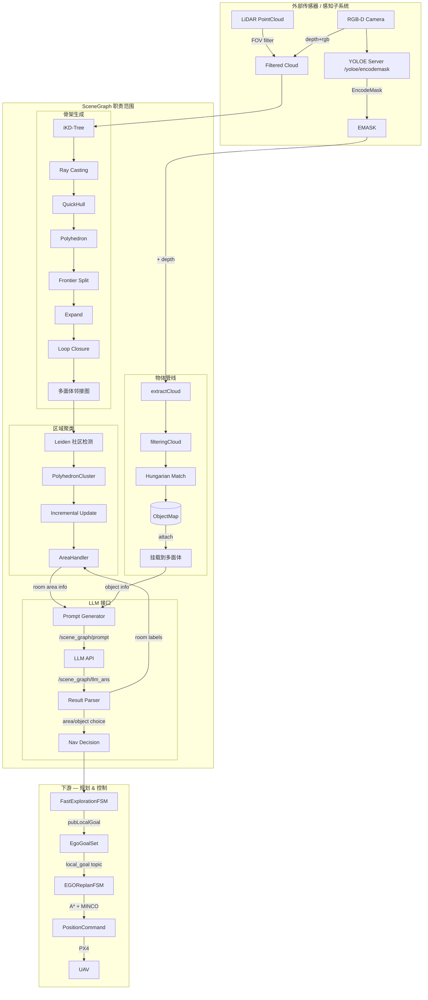
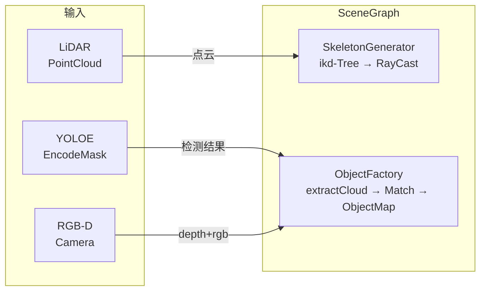
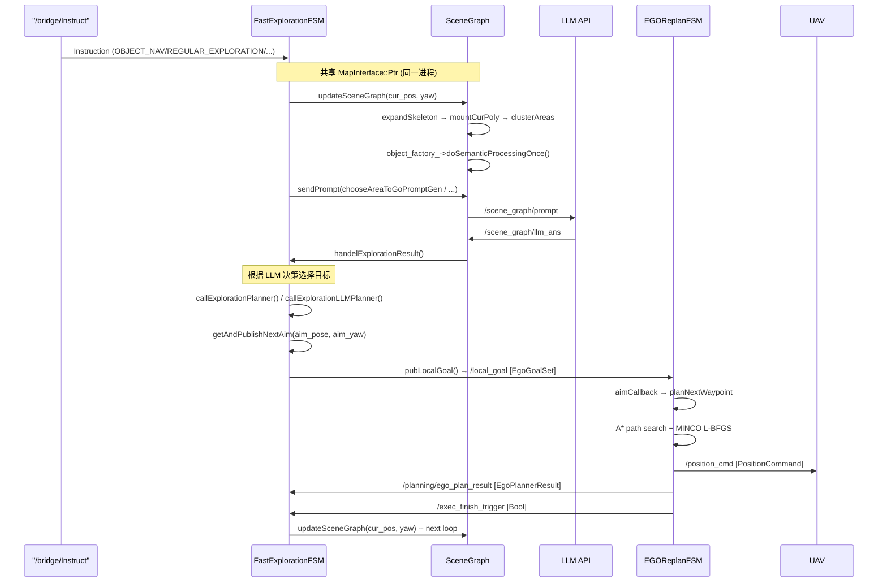

# SceneGraph — 上层环境表征

> 在 USS-NAV 架构中，SceneGraph 位于感知与规划之间，负责构建**结构化语义环境模型**并驱动 LLM 决策。

---

## 概述

SceneGraph 是 ego planner 的**上层环境表征**。它接收原始传感器数据（点云、RGB-D、YOLOE 检测结果），经过多级抽象管线，最终输出：

- 拓扑骨架（navigable free space 的多面体分解）
- 语义区域（房间/区域的聚类与 LLM 标注）
- 目标物体（持久化 ObjectNode 地图）
- LLM 驱动的导航目标（通过 EgoGoalSet 下发至 ego planner）

整个系统位于 `planner/scene_graph/` 目录下，以 ROS 节点形式运行在 `exploration_node` 进程中。

### 三层架构中的位置

```
┌─────────────────────────────────────────────────────────┐
│  Layer 1: Perception                                     │
│  Camera + LiDAR → YOLOE → EncodeMask → ObjectFactory     │
└──────────────────────┬──────────────────────────────────┘
                       ▼
┌─────────────────────────────────────────────────────────┐
│  Layer 2: Scene Understanding ←── SCENEGRAPH             │
│  Skeleton → Areas → Objects → LLM → Semantic Goals      │
└──────────────────────┬──────────────────────────────────┘
                       ▼  EgoGoalSet (local_goal topic)
┌─────────────────────────────────────────────────────────┐
│  Layer 3: Planning & Control                             │
│  EGOReplanFSM → A* + MINCO → PositionCommand → PX4      │
└─────────────────────────────────────────────────────────┘
```

---

## 职责定义

SceneGraph 的职责边界：

**SceneGraph 拥有** — 内部核心算法：
- 骨架生成 — 点云过滤 → iKD-Tree 索引 → 射线投射 → QuickHull 凸多面体 → Frontier 扩展与回环
- 物体管线 — 多帧检测的深度图提取 → 空间+语义关联 → Hungarian 匹配融合 → 持久化 ObjectMap
- 区域聚类 — 多面体邻接图 → Leiden 社区检测 → PolyhedronCluster 增量维护 → 语义区域
- LLM 交互 — 21 种 Prompt 类型生成 → 异步 LLM 请求 → 结果解析 → 导航决策推导

**SceneGraph 不拥有** — 外部依赖和下游消费：
- 传感器驱动 — LiDAR 点云、RGB-D 相机 → raw 数据流入（非 SceneGraph 内部）
- YOLOE 检测 — `/yoloe/encodemask` 是 ObjectFactory 的输入来源（YOLOE 是独立子系统）
- 轨迹规划 — EGO Planner 是 SceneGraph 产出的消费者，通过 EgoGoalSet 松耦合对接
- 状态管理 — `MapInterface` 的 SHM 指针是跨模块共享的基础设施，不参与算法流程

---

## 算法管道



### 核心算法步骤

| 步骤 | 模块 | 方法 | 产出 |
|------|------|------|------|
| 1 | `cloud_fov_limit.cpp` | FOV 滤波 | 无人机视野内的有效点云 |
| 2 | `ikd_Tree.cpp` | 增量 KD-Tree | 空间索引 |
| 3 | `skeleton_generation.cpp` | 射线投射 + QuickHull | 凸多面体（Polyhedron） |
| 4 | `skeleton_generation.cpp` | Frontier 切分与扩展 | 骨架拓扑图 |
| 5 | `skeleton_cluster.cpp` | Leiden 社区检测 | PolyhedronCluster（区域） |
| 6 | `object_factory.cpp` | 深度图→点云提取 | 物体点云 |
| 7 | `object_factory.cpp` | Hungarian 关联融合 | 持久化 ObjectMap |
| 8 | `scene_graph.cpp` | LLM Prompt 生成 | 21 种 prompt 类型 |
| 9 | `scene_graph.cpp` | LLM 结果解析 | 区域标签、导航目标 |

### ObjectFactory 多线程架构

```mermaid
flowchart LR
    subgraph MainThread
        ROSTOPIC["/yoloe/encodemask + depth"]
        ROSTOPIC --> |"segmentResultCallback"| QUEUE["SemanticMsgQueue"]
    end

    subgraph FilterThread
        QUEUE --> |"pop"| DEPTH_EX["extractCloud"]
        DEPTH_EX --> FILTER["filteringCloud"]
        FILTER --> PROC_QUEUE["ProcessedCLoudInput"]
    end

    subgraph ProcessThread
        PROC_QUEUE --> |"doSemanticProcessingOnce"| MATCH["Object Matching"]
        MATCH --> |"Hungarian"| FUSION["Merge into ObjectMap"]
        FUSION --> OBJ_MAP["ObjectMap"]
        OBJ_MAP --> |"visualizeResult"| VIS["/object_all_vis/"]
    end
```



---

## 输入接口

SceneGraph 接收的外部数据来源及其字段定义：

| 来源 | 话题 / 机制 | 内容字段 | 消费方 |
|------|-----------|---------|--------|
| YOLOE Server | `/yoloe/encodemask` (`scene_graph/EncodeMask`) | `labels[]` 物体标签, `confs[]` 置信度, `word_vectors[]` 512-d 文本特征, `masks[]` 分割掩码(CompressedImage), `current_depth` 深度帧, `current_rgb` RGB 帧, `current_odom` 拍摄位姿 | `ObjectFactory::segmentationResultCallback` → `extractCloud` |
| LiDAR | PointCloud (`sensor_msgs/PointCloud2`) | 3D 点云 (x,y,z) → FOV 滤波 → iKD-Tree | `SkeletonGenerator::rayCast()` 碰撞检测、自由空间查询 |
| RGB-D Camera | depth + rgb 图像 (`sensor_msgs/Image` / `CompressedImage`) | 配合 EncodeMask.masks[] 逐 mask 提取物体点云 | `ObjectFactory::extractCloud` → `filteringCloud` |
| 地图 (SHM) | `MapInterface::Ptr` (同进程指针) | GridMap occupancy query → `FREE(0)` / `OCCUPIED(1)` / `UNKNOWN(2)` | `SkeletonGenerator` 射线碰撞 + `Astar` 路径搜索 |
| 里程计 (SHM) | `nav_msgs/Odometry` (同进程订阅) | `pose.pose.position` 位置, `pose.pose.orientation` 姿态 → yaw | `SceneGraph::mountCurPoly()`, `updateSceneGraph()` |

### 输入数据流



### EncodeMask 字段详解

`scene_graph/EncodeMask` 是 YOLOE → ObjectFactory 的核心消息：

```yaml
Header header
nav_msgs/Odometry current_odom       # 拍摄时的无人机位姿（配准点云用）
sensor_msgs/CompressedImage current_depth  # 同步的深度图（压缩）
sensor_msgs/CompressedImage current_rgb    # 同步的 RGB 图（压缩）
string[] labels                # 检测到的物体标签列表
float64[] confs                # 对应置信度
WordVector[] word_vectors      # 512-d 文本特征向量（供语义匹配）
sensor_msgs/CompressedImage[] masks  # 分割掩码（每物体一幅，与 labels 一一对应）
```

### ProcessedCLoudInput 字段详解

ObjectFactory 内部管线的中间产物，同时包含深度、RGB、掩码、位姿：

```yaml
cv::Mat         depth_img         # 深度图
cv::Mat         rgb_img           # RGB 图
cv::Mat         mask              # 单物体分割掩码
Eigen::Matrix4d tf                # 相机→世界变换矩阵
Eigen::Vector3d pos               # 相机拍摄位置
std::string     label             # 物体标签
double          conf              # 置信度
Eigen::VectorXd label_feature     # 512-d 文本特征
Eigen::Vector3d pt_color          # 显示颜色
```

---

## 输出接口

### ROS 话题

| 话题 | 类型 | 方向 | 频率 | 说明 |
|------|------|------|------|------|
| `/scene_graph/vis` | `visualization_msgs/MarkerArray` | 发布 | ~1 Hz | 场景图 3D 可视化（area 包围盒、区域连线、物体） |
| `/scene_graph/prompt` | `scene_graph/PromptMsg` | 发布 | 按需 | LLM 请求（21 种 prompt_type） |
| `/scene_graph/llm_ans` | `scene_graph/PromptMsg` | 订阅 | 按需 | LLM 响应（异步回调） |
| `/skeleton/cluster_vis` | `visualization_msgs/MarkerArray` | 发布 | ~1 Hz | 区域聚类可视化（AreaHandler） |
| `/skeleton/edge_weight_vis` | `visualization_msgs/MarkerArray` | 发布 | ~1 Hz | 骨架边权重可视化 |
| `/object_all_vis` | `visualization_msgs/MarkerArray` | 发布 | ~1 Hz | 全部物体的 OBB+label 可视化 |
| `/object_update_vis` | `visualization_msgs/MarkerArray` | 发布 | 按需 | 增量更新物体可视化 |
| `/scene_graph/json_text` | `std_msgs/String` | 发布 | 按需 | 经 `scenegraph_msg_2_string.py` 桥接的 JSON 文本 |

### 关键消息结构

#### PromptMsg（21 种 prompt 类型）

```yaml
Header header
uint32 prompt_id
uint8  option          # SEND_PROMPT(0) / SEND_ANSWER(1)
uint8  prompt_type     # 0-20 见枚举
string prompt          # prompt 文本或 JSON
string answer          # LLM 返回的文本或 JSON
```

主要 prompt 类型：
- `PROMPT_TYPE_ROOM_PREDICTION` (0) — 区域类型预测（10 种房间类型分类）
- `PROMPT_TYPE_EXPL_PREDICTION` (1) — 探索方向选择
- `PROMPT_TYPE_TERMINATE_OBJ_ID` (3) — 目标物体选择
- `PROMPT_TYPE_DF_DEMO` (4) — 自然语言物体查找演示
- `PROMPT_TYPE_SCENE_GRAPH_JSON` (5) — 完整场景图 JSON 序列化
- `PROMPT_TYPE_LOCAL_PLAN_PREDICTION_A/B` (9-17) — 局部规划决策（多种变体）
- `PROMPT_TYPE_TASK_ASSIGN_PREDICTION` (18-19) — VLA Swarm 任务分配
- `PROMPT_TYPE_TASK_OVER_PREDICTION` (20) — VLA Swarm 任务结束

#### EgoGoalSet（向下游 ego planner 的接口）

```yaml
uint8      drone_id
uint8      source_task_id        # EXPLORATION(2) / COUNTING(8) / VLA_SWARM(9)
float32[3] goal                  # 3D 目标位置
float32    yaw                   # 目标偏航
bool       look_forward          # 是否朝目标方向偏航
uint8      yaw_mode              # NORMAL(0) / LOW_SPEED(1) / PANORAMA(2)
uint8      yaw_path_mode         # SHORTEST(0) / KEEP_DIRECTION(1)
```

#### EgoPlannerResult（从 ego planner 返回的反馈）

```yaml
geometry_msgs/Vector3 planner_goal
int16                  plan_times
bool                   plan_status
bool                   modify_status
```

### 数据桥接（Swarm）

在 `swarm_ros_bridge/config/obj_nav_cfg.yaml` 中配置，通过 ZMQ/UDP 中继的话题：

```yaml
topic_groups:
  - port: 3011
    topic: /drone_0/scene_graph/vis
    ...
  - port: 3013
    topics:
      - /drone_0/scene_graph/prompt
      - /drone_0/scene_graph/llm_ans
    ...
```

### LLM 决策产物 — SceneGraph 的核心输出

SceneGraph 的 LLM 接口处理 21 种 prompt 类型，以下列出直接产生导航决策的关键输出：

| 决策类型 | 输出内容 | 消费方 | 效果 |
|---------|---------|--------|------|
| 区域预测 | `room_label` + `room_description` → `PolyhedronCluster` | FSM 通过 `area_map_` 读取 | 语义标注区域，用于 LLM 推理上下文 |
| 探索方向选择 | `selected area_id` → `callExplorationLLMPlanner()` 在目标区域找 frontier | FSM → `getAndPublishNextAim()` | `aim_pose` = 目标区域中最佳 frontier 位置 |
| 目标物体选择 | `selected object_id` → `getPathToObjectWithId()` → `aim_pose` + `aim_yaw` | FSM → `pubLocalGoal()` | 导航至物体正前方（带朝向） |
| VLA Swarm 规划 | task decomposition JSON → `handleVlaSwarmPlanLocal()` | FSM → 为 followers 分配 | 多机子目标分解与下发 |
| 自然语言演示 (DF Demo) | LLM 解析 `scene_graph_json` → 选择目标物体/区域 | FSM → `execDFDemo()` | 自然语言→导航目标的端到端演示 |

**所有决策最终通过 `pubLocalGoal()` → `EgoGoalSet` 统一下发至 EGO Planner**，语义层面的差异仅在 `source_task_id` 字段标记。

---

## 与 Ego Planner 的 API 对齐

### 架构集成模式

`SceneGraph` 和 `EGOReplanFSM` **不直接耦合**——它们通过 `FastExplorationFSM` 中介连接。



### 集成点一览

| 集成点 | 方式 | 数据 | 方向 |
|--------|------|------|------|
| **共享地图** | `MapInterface::Ptr`（同一进程指针） | 占用网格 + ESDF | SceneGraph ↔ EgoPlanner |
| **目标下发** | ROS Topic `local_goal` | `EgoGoalSet` | FastExplorationFSM → EGOReplanFSM |
| **规划结果反馈** | ROS Topic `/planning/ego_plan_result` | `EgoPlannerResult` | EGOReplanFSM → FastExplorationFSM |
| **执行完成通知** | ROS Topic `exec_finish_trigger` | `std_msgs/Bool` | EGOReplanFSM → FastExplorationFSM |

### 共享地图接口

`MapInterface`（位于 `planner/map_interface/`）是连接 SceneGraph 和 EgoPlanner 的**核心共享数据**：

```cpp
class MapInterface {
    OCCUPANCY getOccupancy(const Eigen::Vector3d &pos);  // FREE / OCCUPIED / UNKNOWN
    bool searchPath(start, end, path, step_size);         // A* path finding
    bool isVisible(p1, p2);                               // line-of-sight check
    double getResolution();
    void getGlobalBox(min, max);
};
```

- SceneGraph 中的 `SkeletonGenerator` 使用 `MapInterface` 进行射线碰撞检测和自由空间查询
- EgoPlanner 中的 `EGOPlannerManager` 使用同一 `MapInterface` 进行碰撞检查和 ESDF 梯度计算
- 两者在同一进程空间共享同一指针，零拷贝开销

### 目标下发协议

```
FastExplorationFSM                    EGOReplanFSM
       │                                   │
       │ pubLocalGoal(goal, yaw,           │
       │   look_forward, yaw_mode)          │
       │──────────────────────────────────►│
       │                                   │ aimCallback()
       │                                   │ ├─ goal[3]: 3D position
       │                                   │ ├─ yaw: target yaw
       │                                   │ ├─ look_forward: yaw toward direction
       │                                   │ ├─ yaw_mode: NORMAL / LOW_SPEED / PANORAMA
       │                                   │ └─ yaw_path_mode: SHORTEST / KEEP_DIRECTION
       │                                   │
       │                                   │ planNextWaypoint()
       │                                   │ ├─ A* search on shared GridMap
       │                                   │ └─ MINCO L-BFGS trajectory optimization
       │                                   │
       │          /planning/ego_plan_result │
       │◄──────────────────────────────────│ EgoPlannerResult(plan_status)
       │                                   │
       │          /exec_finish_trigger      │
       │◄──────────────────────────────────│ Bool(true) — traj execution done
       │                                   │
       │ getAndPublishNextAim() — 下一目标 │
       │──────────────────────────────────►│
```

### FSM 状态对齐

| SceneGraph/FSM 决策 | FastExplorationFSM 状态 | EGOReplanFSM 状态 | EgoGoalSet source_task_id |
|---------------------|----------------------|-------------------|--------------------------|
| LLM 选择探索区域 | `LLM_PLAN_EXPLORE` | `GEN_NEW_TRAJ` | `SOURCE_TASK_EXPLORATION` (2) |
| 前往目标物体 | `GO_TARGET_OBJECT` | `GEN_NEW_TRAJ` | `SOURCE_TASK_EXPLORATION` (2) |
| VLA Swarm 任务 | `VLA_SWARM_PLAN_LOCAL` | `GEN_NEW_TRAJ` | `SOURCE_TASK_VLA_SWARM` (9) |
| 计数任务 | 通过 COUNTING 场景图 | `GEN_NEW_TRAJ` | `SOURCE_TASK_COUNTING` (8) |

---

## FSM 内决策路径详解 — SceneGraph → pubLocalGoal

`pubLocalGoal`（`fast_exploration_fsm.cpp:2172`）是最终 ROS 发布器，真正决策发生在 FSM 状态机上游。共有 6 条路径通向它。

### 决策总览

```
[SceneGraph]                       [FSM Decision]
                              +--> has frontiers in any area?
mountCurTopoPoint() ----------|       YES -> planExploreTSP() -> get frontier viewpoint -> pubLocalGoal()
area_handler_->area_map_ -----|-> LLM asked: "which area to explore?"
  room_label_, num_ftrs_ ----|       LLM returns area_id -> planLLMExploration(area_id)
                              |         +-> filters frontiers by area_id
                              |         +-> TSP within area -> pubLocalGoal()
                              |
                              +--> goTargetObject()
object_factory_->object_map_->|-> getPathToObjectWithId(object_id)
  obj->edge.polyhedron_father |     +-> astarSearch(cur_poly_, obj_father_poly)
                              |     +-> aim_yaw = face object
                              |     +-> height adjustment -> pubLocalGoal()
                              |
                              +--> goTargetWithWaypoint()
skeleton_gen_->astarSearch() -|-> path from current poly to target poly -> pubLocalGoal()
```

### 路径 A — TSP 前沿探索（`PLAN_EXPLORE` / `LLM_PLAN_EXPLORE`）

```
scene_graph_->skeleton_gen_->mountCurTopoPoint(pos)  // 定位当前拓扑节点
→ expl_manager_->planExploreTSP(...)                  // 所有前沿 -> TSP 选最优视点
  → frontier_finder_->getFrontiersWithInfo()          // 获取前沿
  → scene_graph_->skeleton_gen_->mountCurTopoPoint()  // 拓扑定位
  → findGlobalTour_SomeFtrs() → astarSearch()        // 骨架图上的代价矩阵
  → planNextFtr()                                     // 选最佳下一个前沿
→ aim_pos/aim_yaw
→ getAndPublishNextAim() → pubLocalGoal(...)
```

**SceneGraph 输入**: 多面体骨架 (`polyhedron_map_`)、`mountCurTopoPoint` 定位、`astarSearch` 拓扑路径

### 路径 B — LLM 引导区域探索（`LLM_PLAN_EXPLORE`）

```
scene_graph_->needAreaPrediction()                    // 需不需要 LLM 预测当前区域类型?
  → scene_graph_->newAreaPredictionPromptGen()        // 生成 Prompt → LLM
  → LLM 返回 room_label / room_description
→ scene_graph_->chooseAreaToGoPromptGen()             // 问 LLM 该去哪个区域
  → LLM 返回 selected area_id
→ expl_manager_->planLLMExploration(area_id, cur_poly_)
  → 按 ftr.topo_father_->area_id_ == area_id 过滤前沿
  → 区域内 TSP 选视点
→ pubLocalGoal(...)
```

**SceneGraph 输入**: `cur_poly_->area_id_`、`area_handler_->area_map_`（房间标签、前沿数、邻接关系）、LLM prompt/response 系统

### 路径 C — 目标物体导航（`GO_TARGET_OBJECT`）

```
scene_graph_->mountCurPoly(pos, yaw)                  // 找当前多面体
→ scene_graph_->getPathToObjectWithId(object_id)
  → object_factory_->object_map_[id]                   // 查物体
  → obj->edge.polyhedron_father                        // 物体所属多面体
  → skeleton_gen_->astarSearch(cur_poly_, 物体所在多面体)  // 骨架路径
  → aim_pos = 目标多面体中心
  → aim_yaw = 朝向物体方向
→ adjustTerminateHeightFindingObject(cur_obj)          // 高度调整
→ getAndPublishNextAim() → pubLocalGoal(...)
```

**SceneGraph 输入**: `object_factory_->object_map_`、`ObjectNode::pos/label/conf/edge.polyhedron_father`、骨架 astarSearch

### 路径 D — 航点导航（`GO_TARGET_WITH_WAYPOINT`）

```
scene_graph_->mountCurPoly(pos, yaw)
→ skeleton_gen_->mountCurTopoPoint(waypoint, true)     // 航点所属多面体
→ skeleton_gen_->astarSearch(cur_poly_, target_poly)   // 骨架路径
→ getAndPublishNextAim() → pubLocalGoal(...)
```

**SceneGraph 输入**: `skeleton_gen_->mountCurTopoPoint`、多面体图 astarSearch

### 路径 E — Frontier 回调新拓扑发现（`frontierCallback`）

```
scene_graph_->updateSceneGraph(pos, yaw, new_topo)
  → 若 new_topo == true 且需要区域预测 → LLM Prompt
  → 立即发出 stop-and-look 命令:
    pubLocalGoal(skeleton_gen_->cur_iter_first_poly_->center_, aim_direction,
                 false, YAW_MODE_LOW_SPEED)
  → mountCurPoly() + mountCurTopoPoint() 更新定位
```

**SceneGraph 输入**: `skeleton_gen_->cur_iter_first_poly_`（最新扩展多面体）、`updateSceneGraph` 密集检查

### 路径 F — 其他非探索调用

- 接近目标时的偏航旋转: `pubLocalGoal(fd_->aim_pos_, fd_->aim_yaw_, false, YAW_MODE_LOW_SPEED)`
- 全景旋转: `pubLocalGoal(panorama_hold_pos_, panorama_command_target_yaw_, false, YAW_MODE_PANORAMA)`
- 崩溃恢复重发布: 重发当前本地目标
- 追踪目标接近: `pubLocalGoal(fd_->path_res_.back(), fd_->aim_yaw_, look_forward, ...)`

### 数据流总结

```
Odom (position/yaw)
    ↓
FSMCallback (10 Hz) / frontierCallback (2 Hz)
    ↓
scene_graph_->mountCurPoly()          → 定位当前多面体, 获取 cur_poly_
scene_graph_->updateSceneGraph()      → 扩展骨架, 更新物体→区域绑定
    ↓
[FSM 六大决策路径]
    ├─ Path A: 全局 TSP → 所有前沿 → 最佳视点
    ├─ Path B: LLM 选区域 → 区域内前沿 TSP → 最佳视点
    ├─ Path C: 目标物体 → 物体所在多面体 → 面向物体
    ├─ Path D: 指定航点 → 目标多面体 → 路径
    ├─ Path E: 新拓扑 → 悬停环视
    └─ Path F: 偏航/全景/恢复
    ↓
getAndPublishNextAim()  ← 路径压缩优化（取路径中最近可视点）
    ↓
pubLocalGoal(aim_pos, yaw, look_forward, yaw_mode)
    ↓
EgoGoalSet → /planning/goal_set → EGO-Planner
```

所有路径最终汇入 `pubLocalGoal()` → `EgoGoalSet`，差异仅在 `source_task_id` 字段标记。

---

## 数据结构

定义在 `scene_graph/include/scene_graph/data_structure.h`。

### ObjectNode — 持久化物体

```cpp
struct ObjectNode {
    int id;                                    // 唯一 ID
    std::string label;                         // 语义标签（"chair", "person", ...）
    double conf;                               // 置信度
    Eigen::VectorXd label_feature;             // 512-d 语义特征向量
    Eigen::Vector3d pos;                       // 物体中心世界坐标
    Eigen::Vector3d color;                     // 显示颜色
    pcl::PointCloud<pcl::PointXYZRGB>::Ptr cloud; // 物体点云
    pcl::PointCloud<pcl::PointXYZ>::Ptr obb_corners, obb_axis; // OBB 包围盒
    ObjectEdge edge;                           // 对应骨架边
    bool is_alive;                             // 存活标记
    ros::Time last_detection_time;             // 末次检测时间
    unsigned int detection_count;              // 检测帧数计数
};
```

### Polyhedron — 凸多面体（骨架基本单元）

```cpp
class Polyhedron {
    Eigen::Vector3d center_;                   // 几何中心
    bool is_gate_, is_rollbacked_;             // 是否为 gate / 已回退
    double radius_;                            // 半径
    std::vector<VertexPtr> black_vertices_, white_vertices_, gray_vertices_;
    std::vector<FacetPtr> facets_;             // 面
    std::vector<PolyhedronFtrPtr> ftrs_;       // frontier 列表
    std::vector<PolyHedronPtr> connected_nodes_; // 连通多面体
    std::vector<Edge> edges_;                  // 边
    std::map<int, ObjectNodePtr> objs_;        // 本多面体内的物体
    int area_id_;                              // 所属区域 ID
};
```

### PolyhedronCluster — 语义区域

```cpp
class PolyhedronCluster {
    std::vector<PolyHedronPtr> polys_;         // 组成该区域的多面体
    std::vector<ObjectNodePtr> objects_;       // 区域内的物体
    std::string room_label_, room_description_; // LLM 赋予的语义标签
    Eigen::Vector3d box_min_, box_max_;        // AABB
    Eigen::Vector3d center_;                   // 区域中心
    unsigned int id_;                          // 区域 ID
    std::map<int, bool> nbr_area_;             // 相邻区域
    int num_ftrs_;                             // frontier 数量
};
```

### 数据流中的类型转换

```
LiDAR/Camera → PointCloud → ikd-Tree → Polyhedron → PolyhedronCluster(Area)
                                           ↓
                                     ObjectNode (附着于 Polyhedron)
                                           ↓
                                     PromptMsg (序列化为 JSON → LLM)
                                           ↓
                                     EgoGoalSet (导航目标 → ego planner)
```

---

## 配置与启动

### 关键参数

| 参数路径 | 默认值 | 说明 |
|---------|--------|------|
| `fsm/auto_init_scene_graph` | `true` | 是否自动初始化场景图 |
| `fsm/scene_graph_init_forward_dist` | `1.8` | 初始化前向距离 |
| `counting_scene_graph/json_topic` | `/counting_scene_graph/json_text` | COUNTING 场景图 JSON 话题 |
| `MapInterface` 参数文件 | `explore_para.yaml` | 全局地图边界：`drone_{id}_box_min/max_{x/y/z}` |

### 模块间依赖

```
exploration_node (进程)
├── FastExplorationFSM
│   ├── SceneGraph
│   │   ├── SkeletonGenerator ← MapInterface
│   │   ├── ObjectFactory ← MapInterface + 传感器话题
│   │   └── AreaHandler (SpectralCluster / Leiden)
│   └── EGOReplanFSM
│       ├── EGOPlannerManager ← MapInterface
│       ├── A* path_searching
│       └── MINCO traj_opt
```

### 启动文件

```bash
# 仿真模式
roslaunch ego_planner obj_nav.launch
# 实机模式
bash ws_main/src/script/run_with_unknown_map.sh
# 离线场景图编辑器
python ws_main/src/planner/scene_graph/tools/scene_graph_snapshot_editor.py
```

---

## 开发指南

### 代码组织

```
ws_main/src/planner/scene_graph/
├── include/scene_graph/
│   ├── scene_graph.h              # 主 SceneGraph 类
│   ├── data_structure.h           # 核心数据结构
│   ├── skeleton_generation.h      # 骨架生成
│   ├── skeleton_cluster.h         # 区域聚类
│   ├── skeleton_astar.h           # 骨架 A* 搜索
│   ├── object_factory.h           # 目标检测管道
│   ├── ikd_Tree.h                 # 增量 KD-Tree
│   ├── hungarian_alg.h            # Hungarian 匹配
│   ├── traj_visualizer.h          # 轨迹可视化
│   ├── pt_cloud_tools.h           # 点云工具
│   └── counting_scene_graph.h     # COUNTING 变体
├── src/
│   ├── scene_graph.cpp
│   ├── scene_graph_map_io.cpp
│   ├── skeleton_generation.cpp
│   ├── skeleton_cluster.cpp
│   ├── skeleton_astar.cpp
│   ├── object_factory.cpp
│   ├── ikd_Tree.cpp
│   ├── cloud_fov_limit.cpp
│   └── counting_scene_graph.cpp
├── msg/
│   ├── PromptMsg.msg
│   ├── EncodeMask.msg
│   └── WordVector.msg
├── scripts/
│   ├── LLM_interface_thread.py
│   ├── LLM_interface_deepseek_thread.py
│   ├── yoloe_server.py
│   ├── pointcloud_accumulator.py
│   └── scene_graph_snapshot_editor.py
└── saved_data/                     # 离线快照
```

### 扩展新 Prompt 类型

1. 在 `PromptMsg.msg` 中添加 `PROMPT_TYPE_*` 常量
2. 在 `scene_graph.h` 中添加 `*PromptGen()` 声明
3. 在 `scene_graph.cpp` 中实现 prompt 生成逻辑
4. 在 `scene_graph.h` 中添加 `handle*Result()` 声明
5. 在 `scene_graph.cpp` 中实现结果解析逻辑
6. 在 `FastExplorationFSM` 中添加对应的 FSM 状态处理

---

## 附录：与 Ego Planner 的接口兼容性

| SceneGraph 抽象层级 | Ego Planner 可消费的接口 | 对齐方式 |
|---------------------|------------------------|---------|
| 拓扑骨架（Polyhedron 图） | 不直接消费 | 通过 FrontierManager 翻译为 EgoGoalSet |
| 语义区域（PolyhedronCluster） | 不直接消费 | 通过 LLM 决策选择目标区域 |
| 物体（ObjectNode） | 位置和 ID（通过 FrontEnd） | 在 FSM 中调用 getPathToObjectWithId → pubLocalGoal |
| LLM 决策 | 不直接消费 | 仅通过目标位置（goal[3] + yaw）传递给 Ego |
| 占用网格 + ESDF | 共享 GridMap/MapInterface 指针 | 零拷贝共享，SkeletonGenerator 和 EGOPlannerManager 共用 |
