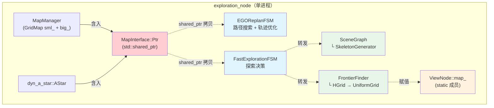

# USS-NAV 架构文档

> 统一文档入口 — 侧边栏 TOC 可折叠/展开各文档章节。
> 全量文档：[CODEBASE](CODEBASE.html) · [SCENEGRAPH](SCENEGRAPH.html) · [EGO](EGO.html)

---

## SceneGraph — 上层环境表征

SceneGraph 位于感知与规划之间，负责构建**结构化语义环境模型**并驱动 LLM 决策。

### 职责边界

| SceneGraph 拥有 | SceneGraph 不拥有 |
|----------------|------------------|
| 骨架生成：iKD-Tree → 射线投射 → QuickHull → 多面体拓扑 | 传感器驱动：LiDAR 点云、RGB-D 相机 raw 数据 |
| 物体管线：多帧检测融合 → Hungarian 匹配 → 持久化 ObjectMap | YOLOE 检测：`/yoloe/encodemask` 是输入来源 |
| 区域聚类：Leiden 社区检测 → PolyhedronCluster → 语义区域 | 轨迹规划：EGO Planner 是 SceneGraph 产出的消费者 |
| LLM 交互：21 种 prompt 生成 → 异步 LLM 请求 → 决策解析 | 同进程共享：`MapInterface::Ptr` (`std::shared_ptr`) 零拷贝跨模块传递 |

### 输入接口

| 来源 | 话题 | 内容 |
|------|------|------|
| YOLOE Server | `/yoloe/encodemask` (EncodeMask) | `labels[]` + `confs[]` + `word_vectors[512]` + `masks[]` + depth/rgb + odom |
| LiDAR | PointCloud | 3D 点云 → FOV 滤波 → iKD-Tree 索引 |
| RGB-D Camera | depth + rgb 图像 | 配合 masks[] 提取物体点云 |
| 栅格地图 (同进程 shared_ptr) | `MapInterface::Ptr` | GridMap occupancy FREE/OCCUPIED/UNKNOWN |
| 里程计 | `nav_msgs/Odometry` | 位姿 → mountCurPoly + updateSceneGraph |

详见完整文档 [SCENEGRAPH.html → 输入接口](SCENEGRAPH.html#输入接口)

### Map 表征层级

代码库中存在多层 Map 表征，`MapInterface::Ptr` 共享的是底层栅格地图：

| 层级 | 类型 | 位置 | 作用 |
|------|------|------|------|
| 核心栅格 | `GridMap` | `plan_env/grid_map.h` | 体素占据 + ESDF 距离场，含环形缓冲区 |
| 双地图管理 | `MapManager` | `plan_env/grid_map.h` | 包裹一局部(sml_)一全局(big_)两个 GridMap |
| 统一接口 | `MapInterface` | `map_interface/map_interface.hpp` | 对外 API Facade，内嵌 MapManager + AStar |
| 拓扑骨架 | `SkeletonGenerator → Polyhedron` | `scene_graph/` | 自由空间多面体拓扑节点 |
| 探索网格 | `HGrid → UniformGrid → GridInfo` | `active_perception/` | 多分辨率前沿分组与视点代价计算 |

> `MapInterface::Ptr` 指向的底层地图是 `MapManager` → 内含两个 `GridMap`（局部+全局）。核心是 `GridMap` 的体素占据栅格与 ESDF 距离场。

以下 Mermaid 图展示 `MapInterface::Ptr` 在同进程内的共享传播路径：



### 输出接口

| 话题 | 类型 | 说明 |
|------|------|------|
| `/scene_graph/vis` | MarkerArray | 场景图 3D 可视化（area 包围盒、连接线、物体） |
| `/scene_graph/prompt` | PromptMsg | LLM 请求（21 种 prompt_type） |
| `/scene_graph/llm_ans` | PromptMsg | LLM 响应（异步回调） |
| `/skeleton/cluster_vis` | MarkerArray | 区域聚类可视化 |
| `/object_all_vis` | MarkerArray | 全部物体的 OBB+label 可视化 |

**核心产出** → `FastExplorationFSM::pubLocalGoal()` → `EgoGoalSet` → `local_goal` topic → EGOReplanFSM

```yaml
# EgoGoalSet 字段
uint8      source_task_id   # EXPLORATION(2)/COUNTING(8)/VLA_SWARM(9)
float32[3] goal             # 3D 目标位置
float32    yaw              # 目标偏航
uint8      yaw_mode         # NORMAL(0)/LOW_SPEED(1)/PANORAMA(2)
```

详见完整文档 [SCENEGRAPH.html → 输出接口](SCENEGRAPH.html#输出接口)

### 算法管道

```
点云 → iKD-Tree → 射线投射 → QuickHull → 多面体
  → Frontier 切分 → 扩展 → 回环 → 多面体邻接图
  → Leiden 社区检测 → PolyhedronCluster → AreaHandler (语义区域)
  + EncodeMask → extractCloud → Hungarian 匹配 → ObjectMap
  → LLM Prompt 生成 → /scene_graph/prompt → LLM → /scene_graph/llm_ans → 决策
```

### 与 EGO 的 API 对齐

```
FastExplorationFSM                    EGOReplanFSM
       │                                   │
       │ pubLocalGoal(EgoGoalSet)          │
       │──────────────────────────────────►│
       │                                   │ A* + MINCO L-BFGS
       │          /planning/ego_plan_result │
       │◄──────────────────────────────────│ (plan_status)
       │          /exec_finish_trigger      │
       │◄──────────────────────────────────│ (traj done)
       │ getAndPublishNextAim() — 下一目标 │
```

- **共享 MapInterface::Ptr** — 同一 GridMap + ESDF，零拷贝（`std::shared_ptr<MapInterface>`，非 IPC 共享内存）
- **松耦合目标下发** — EgoGoalSet 是唯一契约，EGO 不感知 SceneGraph 语义
- **反馈闭环** — EgoPlannerResult + exec_finish_trigger → FSM 决定下一步

详见完整文档 [SCENEGRAPH.html → 与 Ego Planner 的 API 对齐](SCENEGRAPH.html#与-ego-planner-的-api-对齐)

---

## EGO Planner — 实时轨迹优化

EGO-Planner 是底层轨迹规划器，将 FastExplorationFSM 下发的导航目标转换为可执行的平滑轨迹。

### 12 状态 FSM

```
INIT → WAIT_TARGET → GEN_NEW_TRAJ → REPLAN_TRAJ → EXEC_TRAJ → EMERGENCY_STOP
       ↑                                    ↑                         ↓
       └── HANDLE_YAW ── SEQUENTIAL_START ──┴── CRASH_RECOVER ←───────┘
```

### 核心算法

| 组件 | 方法 | 输入 → 输出 |
|------|------|------------|
| `dyn_a_star` | A\* 搜索 | 起点 + 终点 + GridMap → 路径点 |
| `poly_traj_optimizer` | MINCO + L-BFGS | 路径点 + ESDF → 最优轨迹 |
| `traj_server` | 轨迹插值 | 优化轨迹 → PositionCommand @ 100Hz |

### 输出

```
/position_cmd (quadrotor_msgs/PositionCommand)
  - position[3], velocity[3], acceleration[3]
  - yaw, yaw_rate
  → PX4 Controller → UAV
```

### 与 SceneGraph 的集成

- **同一进程**：FastExplorationFSM + SceneGraph + EGOReplanFSM 在 `exploration_node` 中（详见上方 Mermaid 图）
- **同一地图**：共享 `MapInterface::Ptr` → 相同的 GridMap + ESDF
- **目标契约**：仅消费 `EgoGoalSet.goal[3]` + `yaw`，不感知 SceneGraph 语义

详见完整文档 [EGO.html](EGO.html)

---

## CODEBASE — 全量参考

全量代码库文档：[CODEBASE.html](CODEBASE.html)

涵盖：
- 仓库结构与入口
- 三层架构（感知 ↔ 场景理解 ↔ 规划控制）
- 62 个 ROS message 定义
- 算法与数据流
- API 参考（12 Instruction 类型 + 全部 ROS 话题）
- 测试、部署、依赖、术语表
