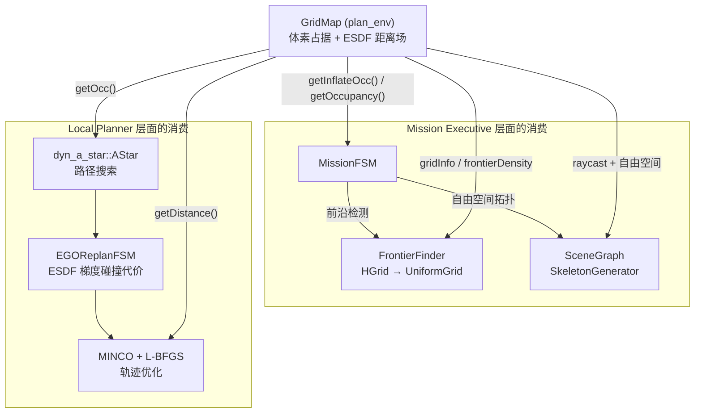

# 数据消费层级

> 从传感器到控制指令的纵向数据流：各层关注什么、消费什么。

---

## 四层架构总览

```
┌─────────────────────────────────────────────────────────────────┐
│  Layer 0: SENSOR / PERCEPTION                                    │
│  原始传感器 → 建图 / 检测                                         │
│  「世界是什么样的」                                                │
│  输出: 占据栅格(ESDF)、物体检测结果(EncodeMask)、里程计           │
└───────────────────────────┬─────────────────────────────────────┘
                            ▼ 同进程 MapInterface::Ptr / ROS topic
┌─────────────────────────────────────────────────────────────────┐
│  Layer 1: MISSION EXECUTIVE                                      │
│  MissionFSM (25+ 状态) + SceneGraph                      │
│  「该做什么」 — 去哪里、探索/追踪、LLM 语义决策                    │
│  输入: /bridge/Instruct, GridMap, SceneGraph                      │
│  输出: local_goal(EgoGoalSet), /triger, /planner_mux/mode          │
└───────────────────────────┬─────────────────────────────────────┘
                            ▼ EgoGoalSet / PoseStamped
┌─────────────────────────────────────────────────────────────────┐
│  Layer 2: LOCAL PLANNER                                          │
│  ┌─ EGOReplanFSM (12 状态) — A* + MINCO 轨迹优化                │
│  └─ Elastic Tracker (planning Nodelet) — 动态目标追踪           │
│  「怎么走」 — 路径搜索、避障、动力学约束                           │
│  输入: Goal + GridMap(ESDF) + 里程计                               │
│  输出: PositionCommand (ego_position_cmd / elastic_position_cmd)   │
└───────────────────────────┬─────────────────────────────────────┘
                            ▼ PlannerCmdMux 汇合
┌─────────────────────────────────────────────────────────────────┐
│  Layer 3: CONTROLLER                                             │
│  PX4 Controller (通过 px4ctrl) → UAV                             │
│  「执行」 — 位置/速度/加速度跟踪                                   │
└─────────────────────────────────────────────────────────────────┘
```

---

## 各层关注点

| 层 | 决策/关注 | 时间尺度 | 抽象级别 |
|----|----------|---------|---------|
| SENSOR / PERCEPTION | 环境建模（占据/ESDF/物体） | ~10-30Hz | 体素/距离场/点云 |
| MISSION EXECUTIVE | 任务调度（探索/追踪/LLM） | ~1-5Hz 决策 | 语义目标/区域/物体 |
| LOCAL PLANNER | 轨迹生成（路径+避障+约束） | ~10-100Hz 重规划 | 多项式轨迹/控制点 |
| CONTROLLER | 姿态跟踪（位置/速度/加速度） | 100-400Hz | 控制信号 |

---

## 层间接口

### Layer 0 → Layer 1/2（感知 → 规划全层）

地图以两种方式被消费：

```
方式 A: 同进程 shared_ptr (EGO 路径)
  GridMap (plan_env) → MapInterface::Ptr → 零拷贝共享给:
    ├─ MissionFSM  (frontier 检测, 探索决策)
    ├─ EGOReplanFSM        (A* 搜索, ESDF 碰撞梯度)
    ├─ SceneGraph          (骨架生成: 自由空间 → 多面体)
    └─ FrontierFinder      (HGrid → UniformGrid, 前沿点视点评估)

方式 B: ROS topic (Elastic Tracker 路径)
  mapping::Nodelet (tracker/mapping)
    └─ gridmap_inflate (OccMap3d) ──→ planning::Nodelet (碰撞检查)
```

### Layer 1 → Layer 2（Mission → Local Planner）

| Topic | 类型 | 方向 | 用途 |
|-------|------|------|------|
| `local_goal` | `EgoGoalSet` | FSM → EGO | 探索/导航目标 |
| `/triger` | `PoseStamped` | FSM → Elastic | 触发追踪 |
| `/planner_mux/mode` | `String` | FSM → Mux | 切换后端 ("ego"/"elastic") |
| `target` (target_odom_topic) | `Odometry` | FSM → Elastic | 追踪目标里程计 |

### Layer 2 → Layer 1（Local Planner → Mission 反馈）

| Topic | 类型 | 方向 | 用途 |
|-------|------|------|------|
| `/planning/ego_plan_result` | `EgoPlannerResult` | EGO → FSM | 规划状态/位置反馈 |
| `exec_finish_trigger` | `Bool` | EGO → FSM | 轨迹执行完成 |
| `/planning/ego_state_trigger` | `EgoStateTrigger` | EGO → FSM | 状态稳定触发 |
| `/drone_0/replanState` | `ReplanState` | Elastic → FSM | 弹性追踪重规划状态 |
| `/elastic_tracker/tracking_finish` | `Bool` | External → FSM | 追踪完成 |

### Layer 2 → Layer 3（Planner → Controller via PlannerCmdMux）

| Topic | 类型 | 来源 | 目标 |
|-------|------|------|------|
| `ego_position_cmd` | `PositionCommand` | EGO TrajServer (100Hz) | PlannerCmdMux |
| `elastic_position_cmd` | `PositionCommand` | Elastic TrajServer | PlannerCmdMux |
| `/position_cmd` | `PositionCommand` | PlannerCmdMux (输出) | PX4 Controller |

---

## 建图为何是 Perception

建图不属于"规划"——它不具备决策或优化行为。它的职能是**将原始传感器数据转化为环境模型**，属于典型的感知管线：

```
原始传感器                       结构化环境模型
  ├─ LiDAR 点云 ──┐
  ├─ 深度图 ──────┤──→ GridMap (占据栅格 + ESDF 距离场)
  ├─ RGB 图像 ────┤──→ EncodeMask → ObjectMap (语义物体)
  └─ 里程计 ──────┘
                           │
                           ▼ 被 mission 和 planner 消费
```

具体到代码：

| 实现 | 位置 | 感知输入 | 规划消费方式 |
|------|------|---------|-------------|
| `GridMap` (sml_ + big_) | `plan_env/grid_map.h` | `/map/occupancy` PointCloud2 | 同进程 MapInterface::Ptr |
| `mapping::OccGridMap` | `tracker/mapping/` | 深度图 + 里程计 | `gridmap_inflate` topic |
| `WsMainMapAdapter` | `tracker/mapping/` | EGO 地图点云 → Elastic 格式 | 桥接转换 |

---

## 地图的双重消费

地图是**基础设施**——mission 和 planner 各自以不同抽象层次消费同一份地图：



### 消费方式对比

| 消费者 | 查询内容 | 用途 |
|--------|---------|------|
| `AStar` | `getOcc()` | 路径搜索碰撞检查 |
| `EGOReplanFSM` | `getDistancePessi()` ESDF 距离 | 梯度优化碰撞代价 |
| `MissionFSM` | `getInflateOcc()` | 飞行路径安全校验 |
| `FrontierFinder` | `getOccupancy()` + `frontierDensity()` | 前沿点检测、覆盖评估 |
| `SceneGraph / SkeletonGenerator` | `raycast()` + 自由空间 | 自由空间多面体分解 |

---

## 数据生命周期：端到端示例

以一次探索任务为例：

```
1. PERCEPTION
   LiDAR + 深度 → GridMap 更新 (占/空/未知)
   Camera → YOLOE → EncodeMask → SceneGraph → ObjectMap
                               ↓
2. MISSION EXECUTIVE
   MissionFSM: frontier 检测 → 选目标
   SceneGraph: 可选 LLM 场景分析 → 区域推荐
                               ↓
   EgoGoalSet { goal[3], yaw, source_task_id: EXPLORATION }
                               ↓  local_goal topic
3. LOCAL PLANNER (EGO)
   EGOReplanFSM::aimCallback() → 设置 final_goal_
   → WAIT_TARGET → SEQUENTIAL_START → GEN_NEW_TRAJ
     → dyn_a_star A* 搜索 → MINCO + L-BFGS 优化
   → EXEC_TRAJ → TrajServer 100Hz PositionCommand
                               ↓  /position_cmd
4. CONTROLLER
   PX4 位置/速度/加速度跟踪 → 电机控制 → UAV 移动
                               ↓
   反馈闭环: exec_finish_trigger(true) → MissionFSM
   → 选择下一个目标 → 循环
```

---

## 相关文档

| 文档 | 内容 |
|------|------|
| [SCENEGRAPH.md](SCENEGRAPH.md) | 场景图架构：骨架、物体、区域、LLM |
| [EGO.md](EGO.md) | EGO-Planner 轨迹优化：12 状态 FSM、算法管道 |
| [CODEBASE.md](CODEBASE.md) | 全量代码参考：三层架构、消息定义、话题清单 |
| [VIEW.md](VIEW.md) | 统一文档入口（多标签导航） |
