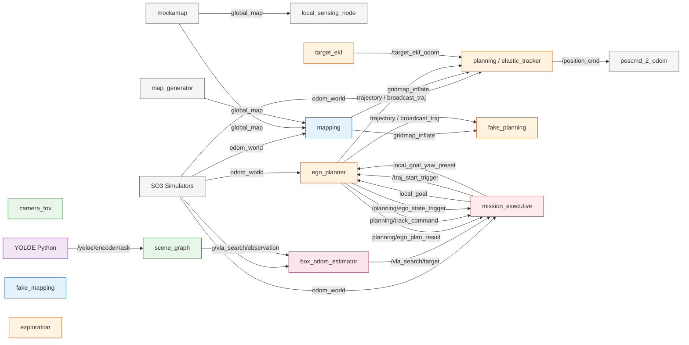

# Package Dependency & Data Flow

> Package-level build dependencies, runtime topic flows, and consumer relationships across the 28 ROS packages in USS-NAV.

---

## 1. camera_fov 消费者

`camera_fov` 是一个纯几何库 (`PerceptionUtils`)，提供相机视锥建模与空间查询。5 个 ROS 参数在所有来源中取值相同：

| 参数 | 值 | 定义位置 |
|------|-----|----------|
| `camera_fov/top_angle` | 0.6 | `advanced_param_sim.xml:174`, `advanced_param_real.xml:174`, `advanced_param_objsam.xml:116`, `sim_ego_planner.yaml:77`, `sim_scenegraph_planner.yaml:83` |
| `camera_fov/left_angle` | 0.76 | 同上 |
| `camera_fov/right_angle` | 0.76 | 同上 |
| `camera_fov/max_dist` | 6.0 | 同上 |
| `camera_fov/vis_dist` | 1.0 | 同上 |

### 编译期消费者

| 消费者包 | 文件 | 引用方式 |
|----------|------|----------|
| `ego_planner` | `traj_server.h:10` | `#include <camera_fov/camera_fov.h>` |
| `exploration` | `frontier_finder.h:12` | `#include <camera_fov/camera_fov.h>` |

### 运行时调用点

#### `ego_planner` — `traj_server.cpp`

| 行号 | FSM 状态 | 方法调用 | 用途 |
|------|----------|----------|------|
| 360 | EXECUTING_TRAJ | `setPose(pos, yaw)` + `getFOV(l1, l2)` | 计算视锥可视化顶点 |
| 363 | EXECUTING_TRAJ | `drawFOV(l1, l2, cmd_vis_pub_)` | 发布 FOV 可视化 Marker |
| 479 | PRE_YAW | `setPose(pos, yaw)` | 预偏航阶段更新相机姿态 |
| 481 | PRE_YAW | `getFOV(l1, l2)` | 预偏航阶段视锥计算 |
| 482 | PRE_YAW | `drawFOV(l1, l2, cmd_vis_pub_)` | 预偏航阶段可视化 |

#### `exploration` — `frontier_finder.cpp`

| 行号 | 方法 | 方法调用 | 用途 |
|------|------|----------|------|
| 836 | `countVisibleCells` | `setPose(pos, yaw)` | 设置当前视角 |
| 840 | `countVisibleCells` | `insideFOV(cell)` | 检查 frontier cell 是否在视场内 |
| 857 | `isWellObserved` | `setPose(vp.pos_, vp.yaw_)` | 从历史视点检查 |
| 860 | `isWellObserved` | `insideFOV(ft.cells_[i])` | 逐 cell 视场判断 |
| 1624 | viewpoint 计数 | `setPose(pos, yaw)` | 更新视角 |
| 1629 | viewpoint 计数 | `insideFOV(cell)` | 计数可视 cell |

#### `exploration` — `frontier_manager.cpp`

| 行号 | 方法 | 方法调用 | 用途 |
|------|------|----------|------|
| 663 | FOV 可视化 | `setPose(...)` | 设置当前姿态 |
| 664 | FOV 可视化 | `getFOV(v1, v2)` | 计算视锥顶点 |

### 非 `camera_fov` 的独立 FOV 系统

`uav_simulator/local_sensing/opengl_sim.hpp` 包含另一套 GPU FOV 系统（`FOV_Checker` + GLSL shader），参数为 `yaw_fov`/`vertical_fov`（典型值 360°/90°），与规划栈的 `PerceptionUtils` **无代码共享**。

---

## 2. 构建依赖图

> 箭头方向：`A → B` 表示 **A 编译/运行时依赖于 B**。仅显示 workspace 内部包，外部依赖（roscpp, Eigen3, PCL 等）省略。

```mermaid
graph TD
  classDef msg fill:#e3f2fd,stroke:#1565c0
  classDef infra fill:#f3e5f5,stroke:#7b1fa2
  classDef planning fill:#fff3e0,stroke:#e65100
  classDef perc fill:#e8f5e9,stroke:#2e7d32
  classDef mission fill:#ffebee,stroke:#c62828
  classDef util fill:#fce4ec,stroke:#880e4f
  classDef sim fill:#f5f5f5,stroke:#616161

  QM[quadrotor_msgs]:::msg
  OD[object_detection_msgs]:::msg
  TU[traj_utils]:::msg
  DM[decomp_ros_msgs]:::msg

  PE[plan_env]:::infra
  PS[path_searching]:::infra
  MI[map_interface]:::infra
  CF[camera_fov]:::infra
  DU[decomp_ros_utils]:::infra
  LK[lkh_tsp_solver]:::infra

  TO[traj_opt]:::planning
  EP[ego_planner]:::planning
  EX[exploration]:::planning
  MP[mapping]:::planning
  TE[target_ekf]:::planning
  PN[planning]:::planning

  SG[scene_graph]:::perc

  ME[mission_executive]:::mission

  BE[box_odom_estimator]:::util

  SQS[so3_quadrotor_simulator]:::sim
  SC[so3_control]:::sim
  LS[local_sensing_node]:::sim
  MK[mockamap]:::sim
  MG[map_generator]:::sim
  PO[poscmd_2_odom]:::sim
  SQ[so3_quadrotor]:::sim
  SCT[so3_controller]:::sim
  FM[fake_mapping]:::sim
  FP[fake_planning]:::sim

  PS --> PE
  MI --> PS
  MI --> PE
  TO --> PE
  TO --> PS
  TO --> TU

  EP --> PE
  EP --> PS
  EP --> TO
  EP --> TU
  EP --> CF
  EP --> SG

  EX --> PE
  EX --> MI
  EX --> PS
  EX --> TU
  EX --> LK
  EX --> CF
  EX --> SG

  MP --> QM
  MP --> OD
  TE --> OD
  PN --> QM
  PN --> MP
  PN --> DU

  SG --> MI
  SG --> QM

  ME --> EP
  ME --> EX
  ME --> SG
  ME --> TU
  ME --> QM

  BE --> SG
  BE --> QM

  SQS --> QM
  SC --> QM
  LS --> QM
  PO --> QM
  SQ --> QM
  SCT --> QM
  FM --> QM
  FM --> OD
  FP --> QM
  FP --> FM
  FP --> DU
  DU --> DM
```



---

## 3. 运行时数据流

> 包级别 topic pub/sub 关系。箭头方向：`Publisher -- topic --> Subscriber`。



---

## 4. 每包消费者表

| 包名 | 构建/运行时依赖（workspace 内部） | 运行时 Topic 订阅 | 被哪些包依赖（workspace 内部） |
|------|--------------------------------|-------------------|-------------------------------|
| **quadrotor_msgs** | — | — | mapping, planning, scene_graph, ego_planner, exploration, mission_executive, box_odom_estimator, all simulator packages |
| **object_detection_msgs** | — | — | target_ekf, mapping, fake_mapping |
| **traj_utils** | — | — | traj_opt, ego_planner, exploration, mission_executive |
| **decomp_ros_msgs** | — | — | decomp_ros_utils |
| **plan_env** | — | — | path_searching, map_interface, traj_opt, ego_planner, exploration |
| **path_searching** | plan_env | — | map_interface, traj_opt, ego_planner, exploration |
| **map_interface** | plan_env, path_searching | — | scene_graph, exploration |
| **camera_fov** | — | — | ego_planner, exploration |
| **decomp_ros_utils** | decomp_ros_msgs | — | planning, fake_planning |
| **lkh_tsp_solver** | — | — | exploration |
| **traj_opt** | plan_env, path_searching, traj_utils | — | ego_planner |
| **ego_planner** | plan_env, path_searching, traj_opt, traj_utils, camera_fov, scene_graph | `odom_world`, `local_goal`, `/traj_start_trigger`, `local_goal_yaw_preset`, `mandatory_stop`, `planning/broadcast_traj_recv` | mission_executive |
| **exploration** | plan_env, map_interface, path_searching, traj_utils, lkh_tsp_solver, camera_fov, scene_graph | — | mission_executive |
| **mapping** | quadrotor_msgs, object_detection_msgs | `grid_map/depth`, `grid_map/odom`, `global_map`, `target`, `/camera/infra1/image_rect_raw` | planning |
| **target_ekf** | object_detection_msgs | `odom`, `BoundingBoxes` | planning (via topic) |
| **planning** | quadrotor_msgs, mapping, decomp_ros_utils | `gridmap_inflate`, `odom`, `target`, `triger`, `trajectory`, `heartbeat`, `replanState` | mission_executive (via track_command) |
| **scene_graph** | map_interface, quadrotor_msgs | `seg_result_topic`, `map_inflate_sub_`, `cmd_sub_`, `llm_ans_sub_`, `emergency_stop_sub_` | ego_planner, exploration, mission_executive, box_odom_estimator |
| **mission_executive** | ego_planner, exploration, scene_graph, traj_utils, quadrotor_msgs | `/bridge/Instruct`, `odom_world`, `/planning/ego_plan_result`, `exec_finish_trigger`, `/planning/track_command`, `/tracking_target`, `/vla_search/target`, `/planning/ego_state_trigger`, `elastic_tracker_*`, `/command/emergency_stop`, `/move_base_simple/goal` | — |
| **box_odom_estimator** | scene_graph, quadrotor_msgs | `odom`, `/vla_search/observation`, `~/bbox_topic` | — |
| **so3_quadrotor_simulator** | quadrotor_msgs | — | — |
| **so3_control** | quadrotor_msgs | `command` | — |
| **local_sensing_node** | quadrotor_msgs | `global_map`, `odometry` | — |
| **mockamap** | — | — | — |
| **map_generator** | — | — | — |
| **poscmd_2_odom** | quadrotor_msgs | `command` | — |
| **so3_quadrotor** | quadrotor_msgs | — | — |
| **so3_controller** | quadrotor_msgs | — | — |
| **fake_mapping** | quadrotor_msgs, object_detection_msgs | `grid_map/depth`, `grid_map/odom`, `local_pcl` | fake_planning |
| **fake_planning** | quadrotor_msgs, fake_mapping, decomp_ros_utils | `gridmap_inflate`, `odom`, `target`, `triger`, `trajectory`, `heartbeat` | — |

---

## 5. 关键数据流拓扑

```
Ground Station / Bridge
  └─ /bridge/Instruct ──→ mission_executive (顶层 FSM)

mission_executive
  ├─ local_goal ──→ ego_planner (EGO 重规划)
  ├─ /traj_start_trigger ──→ ego_planner
  ├─ /planning/track_command ──→ elastic tracker
  └─ (接收) ←── ego_plan_result / track_command / vla_search/target

ego_planner 
  └─ trajectory (PolyTraj/MINCOTraj) ──→ planning / elastic_tracker

perception pipeline
  YOLOE → encodemask → scene_graph (ObjectFactory)
  scene_graph → vla_search/observation → box_odom_estimator (VLA target fusion)
  box_odom_estimator → vla_search/target → mission_executive (导航目标)

mapping
  depth + odom + global_map → OccMap3d → gridmap_inflate ──→ planning / fake_planning
```
